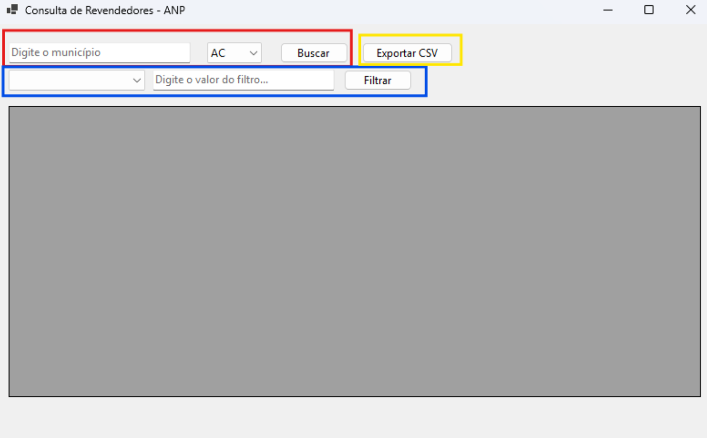
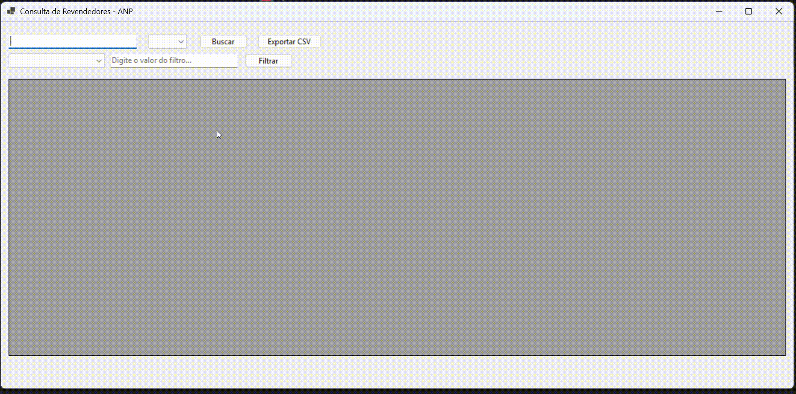
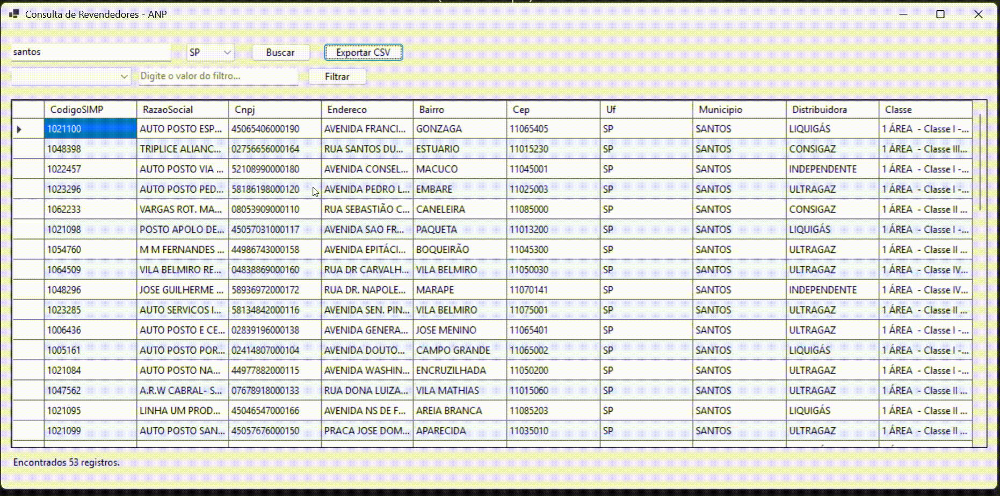
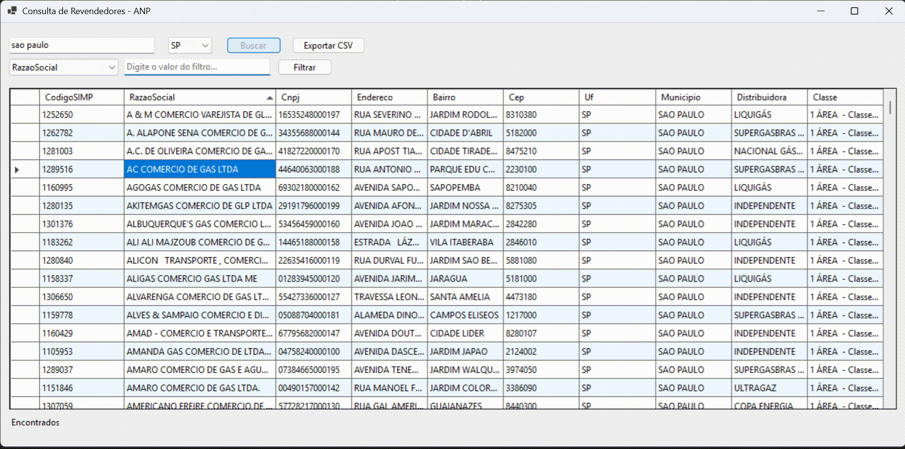

# 🛢️ IMEX – Consulta de Revendedores ANP

Aplicação **Windows Forms (.NET 8)** desenvolvida como parte do processo seletivo da **IMEX**.  

O sistema consome a **API pública da ANP (Agência Nacional do Petróleo, Gás Natural e Biocombustíveis)** para listar **revendedores de GLP** por município e UF.  

[Documentação da API ANP](https://www.gov.br/anp/pt-br/centrais-de-conteudo/paineis-dinamicos-da-anp/paineis-dinamicos-do-abastecimento/api-revendedores-manual-usuario.pdf)

---

## ✨ Funcionalidades

- 🔎 **Busca por UF e Município** (consumo direto da API da ANP).  
- 🗂️ **Exibição tabular** em `DataGridView` com ordenação por coluna.  
- 📊 **Filtro por coluna** (ex.: mostrar apenas CNPJs com “53”, ou distribuidora contendo “GÁS”).  
- 💾 **Cache em memória**: evita chamadas desnecessárias à API para a mesma consulta.  
- 📑 **Exportar CSV**: permite salvar os resultados em arquivo CSV para análise externa.  
- 🖱️ **Detalhes por duplo clique**: exibe informações completas de um revendedor selecionado.  
- 🎨 **Melhorias de UI**: colunas redimensionáveis, linhas em zebra, mensagens amigáveis.  

---

## 🛠️ Tecnologias utilizadas

- [.NET 8](https://dotnet.microsoft.com/)  
- Windows Forms  
- `HttpClient` para consumo da API  
- `System.Text.Json` para desserialização  
- `DataGridView` para exibição dos dados  

---

## 📦 Estrutura do Projeto
```
IMEX
┣ Models
┃ ┗ Revendedor.cs
┣ Services
┃ ┗ RevendedorService.cs
┣ Forms
┃ ┗ Form1.cs / Form1.Designer.cs
┣ Program.cs
┗ README.md
```
---

## ▶️ Como rodar

1. Clone o repositório:
   ```bash
   git clone https://github.com/theoxdev/imex.git
2. Abra a solução no Visual Studio 2022+.

3. Restaure dependências e compile.

4. Execute o projeto (Ctrl + F5).

## 🧪 Casos de Teste (UFs e Municípios)

Use as combinações abaixo para testar a aplicação com dados reais da API da ANP:

- **MS – Mato Grosso do Sul**
  - Campo Grande
  - Dourados

- **SP – São Paulo**
  - São Paulo
  - Campinas

- **RJ – Rio de Janeiro**
  - Rio de Janeiro
  - Niterói

- **MG – Minas Gerais**
  - Belo Horizonte
  - Uberlândia

- **BA – Bahia**
  - Salvador
  - Feira de Santana

- **RS – Rio Grande do Sul**
  - Porto Alegre
  - Caxias do Sul


## 📷 Prints da aplicação

### Layout inicial
🟥 Tela inicial com busca

🟦 Filtros

🟨 Exportação em CSV



### Resultado da API no grid



### Detalhes de um revendedor (duplo clique)


### Filtragem por coluna e por campo



## 🚀 Melhorias implementadas além do escopo básico

Cache em memória para otimizar consumo da API.

Exportação em CSV com cabeçalho.

Mensagens de feedback claras (sem registros, erro na API, etc.).

Código organizado em camadas (Models, Services, Forms).

## 👨‍💻 Autor

Matheus Nascimento
Desafio técnico – IMEX